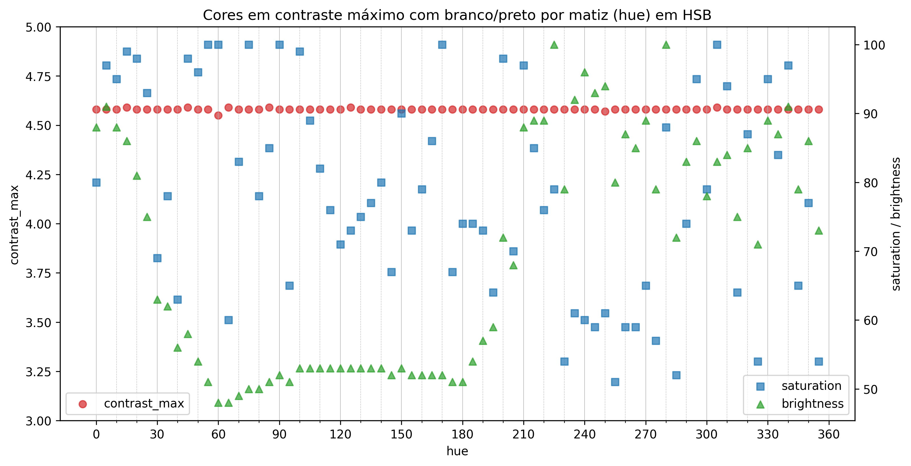
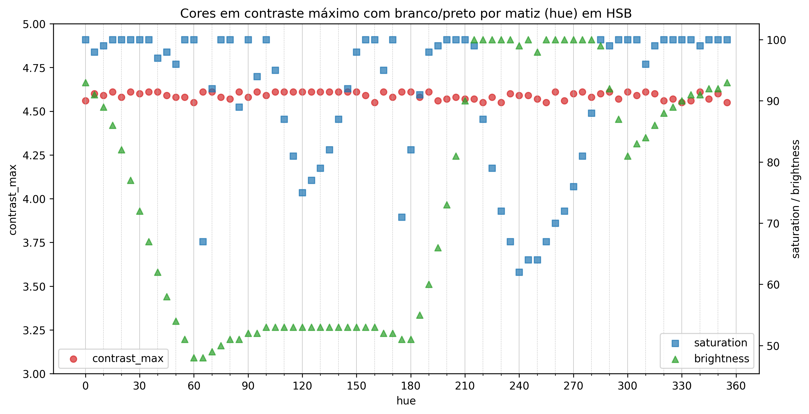
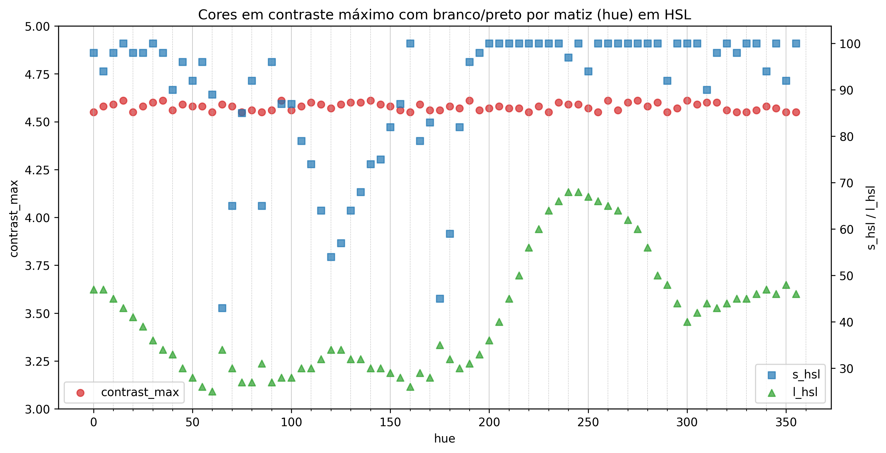

# **Design Acessível: Encontrando o Contraste Perfeito para Modos Claro e Escuro**

## O dilema do modo escuro: como uma análise de dados revelou as cores que funcionam em qualquer lugar.

Imagine a cena: você, dev front-end ou web designer, escolhe a cor primária perfeita para um projeto. Um azul profundo, `(#0000FF, hsl(240,100,50), rgb(0, 0, 255)`. Fica incrível nos botões, links e gráficos sobre o fundo branco. Missão cumprida. 🎨

Até que chega a hora de implementar o modo escuro. E aquele azul profundo... desaparece. Contra o fundo preto, ele se torna quase ilegível, forçando você a criar uma variável de cor totalmente diferente só para o tema escuro.

Esse é um desafio clássico de design e acessibilidade. Uma mesma cor raramente possui um bom contraste tanto em fundos claros quanto escuros. Isso não afeta apenas a estética, mas também a legibilidade e a conformidade com as [diretrizes](https://www.w3.org/TR/WCAG21/) da WCAG (Web Content Accessibility Guidelines).

> Nota: Essa legibilidade pode ser quantificada por uma métrica chamada **taxa de contraste**. A WCAG recomenda uma taxa mínima de `4.5:1` para texto normal. Uma implementação online dessa métrica pode ser encontrada [aqui](https://coolors.co/contrast-checker/).

Eu estava frustrado com um problema semelhante, mas bem menor. Afinal de contas, não trabalho com front end e nem sou designer. Sou um cientista/engenheiro de dados e comumente sinto necessidade de criar documentações visuais e tutoriais com muitas captura de telas customizados, para compartilhar processos, resultados e insights.

Meu problema pode parecer bobo, mas eu buscava o melhor contraste para as cores de setas, círculos e demais elementos visuais que uso para customizar captura de telas usando o software [Sharex](https://getsharex.com/). Um problema realmente bobo, mas que me fez refletir sobre a questão maior do design acessível.

Para resolver esse problema, decidi mergulhar em análise de dados para encontrar uma solução sistemática. A pergunta era simples: **qual é o tom ideal de cada cor essencial para maximizar a legibilidade em fundos pretos e brancos simultaneamente?**

### O contraste é uma métrica verificável

Você já se pegou pensando: "Acho que esse cinza claro funciona bem nesse fundo branco"? A boa notícia é que, no mundo do design acessível, a legibilidade não depende de "achismos". O contraste é uma métrica precisa, matemática e totalmente verificável.

A WCAG define um cálculo claro para a **taxa de contraste**, que varia de 1:1 (cores idênticas) a 21:1 (preto e branco). Para garantir a conformidade AA, a meta para textos normais é atingir ou superar a marca de **4.5:1**. Isso transforma a acessibilidade de uma opinião subjetiva em um resultado que pode ser medido e validado.

Mas como um computador "vê" o brilho da mesma forma que nossos olhos? A resposta está na **luminância relativa**. O olho humano não percebe o brilho de forma linear; somos muito mais sensíveis ao verde do que ao vermelho ou azul. Por isso, a fórmula da WCAG não trata R, G e B como iguais. Ela aplica pesos baseados na fisiologia do olho (padrão ITU-R BT.709), que são aproximadamente:
- 🟢 **71%** para o canal Verde
- 🔴 **21%** para o canal Vermelho
- 🔵 **7%** para o canal Azul

Essa ponderação garante que o cálculo reflita a percepção humana, explicando por que um verde puro `(0, 255, 0)` parece muito mais "brilhante" que um azul puro `(0, 0, 255)`.

Antes de ponderar os canais R, G e B, há um passo crucial chamado **linearização**. Os valores sRGB que usamos (de 0 a 255) não representam a intensidade da luz de forma linear. Eles são comprimidos por uma **correção de gama (gamma correction)**, que se alinha com a percepção humana de brilho. Para realizar cálculos de contraste precisos, a fórmula da WCAG primeiro "desfaz" essa compressão, convertendo cada canal de cor para uma escala linear, chamada de luminância.

O processo para calcular essa luminância de cada canal de cor é o seguinte:
- O valor normalizado de cada canal é obtido dividindo o valor original por `255`;
- Para cores muito escuras (com valor normalizado abaixo de `0.03928`), a relação é quase linear e se resolve com uma simples divisão por `12.92`;
- Para todas as outras, uma função de potência à **2.4** é aplicada para reverter a compressão. Especificamente:

`Luminância = ((valor_normalizado + 0.055) / 1.055) ** 2.4`

É este cálculo que transforma um valor de cor digital RGB em uma representação fiel da intensidade da luz (luminância), informação essencial para o cálculo de contraste.

Após obter a luminância de cada canal, é realizado o cálculo de luminância relativa (L) através da ponderação dos valores com base na percepção humana, como indicado anteriormente:

`L = 0.2126 * R_linear + 0.7152 * G_linear + 0.0722 * B_linear`

Com a luminância relativa (L) de cada cor calculada, a fórmula final da WCAG entra em ação para determinar a taxa de contraste.

O cálculo é simples e elegante: `(L1 + 0.05) / (L2 + 0.05)`, onde L1 é a luminância da cor mais clara e L2 a da mais escura. O pequeno acréscimo de 0.05 é uma compensação para o brilho ambiente, evitando divisões por zero com o preto puro. No fim das contas, o que define um bom contraste não é uma escolha artística arbitrária, mas sim um cálculo verificável que garante que seu design seja legível.

### A Jornada em Busca do Equilíbrio 🕵️‍♂️

O objetivo era encontrar, para cada matiz (hue) no círculo cromático, a combinação perfeita de saturação e brilho que resultasse em um nível de contraste similar contra fundo branco e fundo preto.

Para isso, criei um script que iterou por milhares de variações de cores no espaço de cor **HSB (Hue, Saturation, Brightness)**, calculando para cada uma:
1.  O contraste contra o branco.
2.  O contraste contra o preto.
3.  A diferença absoluta entre os dois valores de contraste.

A primeira abordagem foi óbvia: para cada matiz, escolher a cor com a menor diferença de contraste possível. No entanto, os resultados foram instáveis.



Um pequeno ganho de 0.1 na taxa de contraste levava a saltos enormes nos valores de brilho e saturação entre matizes vizinhos, criando uma paleta visualmente inconsistente.

### A Solução: Uma Janela de Tolerância Inteligente 💡

A superação da inconsistência veio de uma observação: Uma variação pouco significante na diferença de contraste poderia ser aceitável, sendo mais importante a estabilidade do brilho.

**Mas qual limiar de significância escolher?**

Decidi pela menor tolerância possível desde que fosse aplicada de forma consistente para todos os matizes. Esse valor de tolerância poderia ser encontrado pela busca da cor correspondente ao "pior cenário". A análise mostrou que o amarelo (hue 60) era a cor com a maior diferença inevitável de contraste, mesmo em seu ponto ótimo, com um valor de `0.06`.

Essa foi a chave! Usei esse valor como uma janela de tolerância. A nova estratégia foi:

1.  Para cada matiz, filtre todas as cores cuja diferença de contraste seja **menor ou igual a 0.06**.
2.  Dentro desse grupo de cores "aceitáveis", selecione aquela com o **maior brilho (brightness)**.



Essa abordagem suavizou drasticamente as variações de brilho, resultando em uma paleta de cores muito mais harmônica, sem sacrificar a legibilidade em nenhum dos matizes.



Também gerei visualização dos parâmetros em notação HSL. Nela é possível visualizar com ainda mais clareza que cores quentes exigem menor luminosidade e cores frias exigem maior luminosidade para alcançar o contraste ideal.

### A Paleta de Contraste Ideal 🏆

O resultado final é uma paleta com 36 tons cuidadosamente selecionados — um para cada 10 graus de matiz — ideais para anotações, highlights ou qualquer elemento de interface que precise se destacar em qualquer modo.

Aqui estão alguns exemplos:
* **Vermelho (hue 0):** rgb(96, 96, 252) `#ED0202 hsb(240, 62, 99) hsl(240, 97, 68) `
* **Verde (hue 120):** rgb(41, 135, 41) `#298729 hsb(120, 70, 53) hsl(120, 54, 34) `
* **Azul (hue 240):** rgb(96, 96, 252) `#6060FC hsb(240, 62, 99) hsl(240, 97, 68) `
* **Magenta (hue 300):** rgb(207, 0, 207) `#CF00CF hsb(300, 100, 81) hsl(300, 100, 40)`


Essas cores garantem um contraste mínimo de `4.5:1`, atendendo aos critérios da WCAG AA para texto normal, seja em um slide de apresentação branco ou preto.

Este estudo mostra que, em vez de criar paletas duplicadas, podemos encontrar um único tom otimizado com um pouco de análise.

Acesse o notebook [contraste.ipynb](./contraste.ipynb) para acompanhar toda a jornada de descoberta das cores que funcionam em qualquer lugar. 😁


Para facilitar a reutilização, segue a paleta de 36 cores ideais em 4 notações:

| hue | HSB               | HSL               | RGB               | hex     |
| --- | ----------------- | ----------------- | ----------------- | ------- |
| 0   | hsb(0, 99, 93)    | hsl(0, 98, 47)    | rgb(237, 2, 2)    | #ED0202 |
| 10  | hsb(10, 99, 89)   | hsl(10, 98, 45)   | rgb(227, 40, 2)   | #E32802 |
| 20  | hsb(20, 99, 82)   | hsl(20, 98, 41)   | rgb(209, 71, 2)   | #D14702 |
| 30  | hsb(30, 100, 72)  | hsl(30, 100, 36)  | rgb(184, 92, 0)   | #B85C00 |
| 40  | hsb(40, 95, 62)   | hsl(40, 90, 33)   | rgb(158, 108, 8)  | #9E6C08 |
| 50  | hsb(50, 96, 54)   | hsl(50, 92, 28)   | rgb(138, 116, 6)  | #8A7406 |
| 60  | hsb(60, 94, 48)   | hsl(60, 89, 25)   | rgb(122, 122, 7)  | #7A7A07 |
| 70  | hsb(70, 79, 49)   | hsl(70, 65, 30)   | rgb(108, 125, 26) | #6C7D1A |
| 80  | hsb(80, 96, 51)   | hsl(80, 92, 27)   | rgb(88, 130, 5)   | #588205 |
| 90  | hsb(90, 98, 52)   | hsl(90, 96, 27)   | rgb(68, 133, 3)   | #448503 |
| 100 | hsb(100, 93, 53)  | hsl(100, 87, 28)  | rgb(51, 135, 9)   | #338709 |
| 110 | hsb(110, 85, 53)  | hsl(110, 74, 30)  | rgb(39, 135, 20)  | #278714 |
| 120 | hsb(120, 70, 53)  | hsl(120, 54, 34)  | rgb(41, 135, 41)  | #298729 |
| 130 | hsb(130, 78, 53)  | hsl(130, 64, 32)  | rgb(30, 135, 47)  | #1E872F |
| 140 | hsb(140, 85, 53)  | hsl(140, 74, 30)  | rgb(20, 135, 59)  | #14873B |
| 150 | hsb(150, 90, 53)  | hsl(150, 82, 29)  | rgb(14, 135, 74)  | #0E874A |
| 160 | hsb(160, 100, 53) | hsl(160, 100, 26) | rgb(0, 135, 90)   | #00875A |
| 170 | hsb(170, 91, 52)  | hsl(170, 83, 28)  | rgb(12, 133, 112) | #0C8570 |
| 180 | hsb(180, 74, 51)  | hsl(180, 59, 32)  | rgb(34, 130, 130) | #228282 |
| 190 | hsb(190, 98, 60)  | hsl(190, 96, 31)  | rgb(3, 128, 153)  | #038099 |
| 200 | hsb(200, 100, 73) | hsl(200, 100, 36) | rgb(0, 124, 186)  | #007CBA |
| 210 | hsb(210, 100, 90) | hsl(210, 100, 45) | rgb(0, 115, 230)  | #0073E6 |
| 220 | hsb(220, 87, 100) | hsl(220, 100, 56) | rgb(33, 107, 255) | #216BFF |
| 230 | hsb(230, 72, 100) | hsl(230, 100, 64) | rgb(71, 102, 255) | #4766FF |
| 240 | hsb(240, 62, 99)  | hsl(240, 97, 68)  | rgb(96, 96, 252)  | #6060FC |
| 250 | hsb(250, 64, 98)  | hsl(250, 94, 67)  | rgb(117, 90, 250) | #755AFA |
| 260 | hsb(260, 70, 100) | hsl(260, 100, 65) | rgb(136, 77, 255) | #884DFF |
| 270 | hsb(270, 76, 100) | hsl(270, 100, 62) | rgb(158, 61, 255) | #9E3DFF |
| 280 | hsb(280, 88, 100) | hsl(280, 100, 56) | rgb(180, 31, 255) | #B41FFF |
| 290 | hsb(290, 96, 92)  | hsl(290, 92, 48)  | rgb(197, 9, 235)  | #C509EB |
| 300 | hsb(300, 100, 81) | hsl(300, 100, 40) | rgb(207, 0, 207)  | #CF00CF |
| 310 | hsb(310, 95, 84)  | hsl(310, 90, 44)  | rgb(214, 11, 180) | #D60BB4 |
| 320 | hsb(320, 100, 88) | hsl(320, 100, 44) | rgb(224, 0, 150)  | #E00096 |
| 330 | hsb(330, 100, 90) | hsl(330, 100, 45) | rgb(230, 0, 115)  | #E60073 |
| 340 | hsb(340, 97, 91)  | hsl(340, 94, 47)  | rgb(232, 7, 82)   | #E80752 |
| 350 | hsb(350, 96, 92)  | hsl(350, 92, 48)  | rgb(235, 9, 47)   | #EB092F |

```json
[{'hue': 0,
  'HSB': 'hsb(0, 99, 93)',
  'HSL': 'hsl(0, 98, 47)',
  'RGB': 'rgb(237, 2, 2)',
  'hex': '#ED0202'},
 {'hue': 10,
  'HSB': 'hsb(10, 99, 89)',
  'HSL': 'hsl(10, 98, 45)',
  'RGB': 'rgb(227, 40, 2)',
  'hex': '#E32802'},
 {'hue': 20,
  'HSB': 'hsb(20, 99, 82)',
  'HSL': 'hsl(20, 98, 41)',
  'RGB': 'rgb(209, 71, 2)',
  'hex': '#D14702'},
 {'hue': 30,
  'HSB': 'hsb(30, 100, 72)',
  'HSL': 'hsl(30, 100, 36)',
  'RGB': 'rgb(184, 92, 0)',
  'hex': '#B85C00'},
 {'hue': 40,
  'HSB': 'hsb(40, 95, 62)',
  'HSL': 'hsl(40, 90, 33)',
  'RGB': 'rgb(158, 108, 8)',
  'hex': '#9E6C08'},
 {'hue': 50,
  'HSB': 'hsb(50, 96, 54)',
  'HSL': 'hsl(50, 92, 28)',
  'RGB': 'rgb(138, 116, 6)',
  'hex': '#8A7406'},
 {'hue': 60,
  'HSB': 'hsb(60, 94, 48)',
  'HSL': 'hsl(60, 89, 25)',
  'RGB': 'rgb(122, 122, 7)',
  'hex': '#7A7A07'},
 {'hue': 70,
  'HSB': 'hsb(70, 79, 49)',
  'HSL': 'hsl(70, 65, 30)',
  'RGB': 'rgb(108, 125, 26)',
  'hex': '#6C7D1A'},
 {'hue': 80,
  'HSB': 'hsb(80, 96, 51)',
  'HSL': 'hsl(80, 92, 27)',
  'RGB': 'rgb(88, 130, 5)',
  'hex': '#588205'},
 {'hue': 90,
  'HSB': 'hsb(90, 98, 52)',
  'HSL': 'hsl(90, 96, 27)',
  'RGB': 'rgb(68, 133, 3)',
  'hex': '#448503'},
 {'hue': 100,
  'HSB': 'hsb(100, 93, 53)',
  'HSL': 'hsl(100, 87, 28)',
  'RGB': 'rgb(51, 135, 9)',
  'hex': '#338709'},
 {'hue': 110,
  'HSB': 'hsb(110, 85, 53)',
  'HSL': 'hsl(110, 74, 30)',
  'RGB': 'rgb(39, 135, 20)',
  'hex': '#278714'},
 {'hue': 120,
  'HSB': 'hsb(120, 70, 53)',
  'HSL': 'hsl(120, 54, 34)',
  'RGB': 'rgb(41, 135, 41)',
  'hex': '#298729'},
 {'hue': 130,
  'HSB': 'hsb(130, 78, 53)',
  'HSL': 'hsl(130, 64, 32)',
  'RGB': 'rgb(30, 135, 47)',
  'hex': '#1E872F'},
 {'hue': 140,
  'HSB': 'hsb(140, 85, 53)',
  'HSL': 'hsl(140, 74, 30)',
  'RGB': 'rgb(20, 135, 59)',
  'hex': '#14873B'},
 {'hue': 150,
  'HSB': 'hsb(150, 90, 53)',
  'HSL': 'hsl(150, 82, 29)',
  'RGB': 'rgb(14, 135, 74)',
  'hex': '#0E874A'},
 {'hue': 160,
  'HSB': 'hsb(160, 100, 53)',
  'HSL': 'hsl(160, 100, 26)',
  'RGB': 'rgb(0, 135, 90)',
  'hex': '#00875A'},
 {'hue': 170,
  'HSB': 'hsb(170, 91, 52)',
  'HSL': 'hsl(170, 83, 28)',
  'RGB': 'rgb(12, 133, 112)',
  'hex': '#0C8570'},
 {'hue': 180,
  'HSB': 'hsb(180, 74, 51)',
  'HSL': 'hsl(180, 59, 32)',
  'RGB': 'rgb(34, 130, 130)',
  'hex': '#228282'},
 {'hue': 190,
  'HSB': 'hsb(190, 98, 60)',
  'HSL': 'hsl(190, 96, 31)',
  'RGB': 'rgb(3, 128, 153)',
  'hex': '#038099'},
 {'hue': 200,
  'HSB': 'hsb(200, 100, 73)',
  'HSL': 'hsl(200, 100, 36)',
  'RGB': 'rgb(0, 124, 186)',
  'hex': '#007CBA'},
 {'hue': 210,
  'HSB': 'hsb(210, 100, 90)',
  'HSL': 'hsl(210, 100, 45)',
  'RGB': 'rgb(0, 115, 230)',
  'hex': '#0073E6'},
 {'hue': 220,
  'HSB': 'hsb(220, 87, 100)',
  'HSL': 'hsl(220, 100, 56)',
  'RGB': 'rgb(33, 107, 255)',
  'hex': '#216BFF'},
 {'hue': 230,
  'HSB': 'hsb(230, 72, 100)',
  'HSL': 'hsl(230, 100, 64)',
  'RGB': 'rgb(71, 102, 255)',
  'hex': '#4766FF'},
 {'hue': 240,
  'HSB': 'hsb(240, 62, 99)',
  'HSL': 'hsl(240, 97, 68)',
  'RGB': 'rgb(96, 96, 252)',
  'hex': '#6060FC'},
 {'hue': 250,
  'HSB': 'hsb(250, 64, 98)',
  'HSL': 'hsl(250, 94, 67)',
  'RGB': 'rgb(117, 90, 250)',
  'hex': '#755AFA'},
 {'hue': 260,
  'HSB': 'hsb(260, 70, 100)',
  'HSL': 'hsl(260, 100, 65)',
  'RGB': 'rgb(136, 77, 255)',
  'hex': '#884DFF'},
 {'hue': 270,
  'HSB': 'hsb(270, 76, 100)',
  'HSL': 'hsl(270, 100, 62)',
  'RGB': 'rgb(158, 61, 255)',
  'hex': '#9E3DFF'},
 {'hue': 280,
  'HSB': 'hsb(280, 88, 100)',
  'HSL': 'hsl(280, 100, 56)',
  'RGB': 'rgb(180, 31, 255)',
  'hex': '#B41FFF'},
 {'hue': 290,
  'HSB': 'hsb(290, 96, 92)',
  'HSL': 'hsl(290, 92, 48)',
  'RGB': 'rgb(197, 9, 235)',
  'hex': '#C509EB'},
 {'hue': 300,
  'HSB': 'hsb(300, 100, 81)',
  'HSL': 'hsl(300, 100, 40)',
  'RGB': 'rgb(207, 0, 207)',
  'hex': '#CF00CF'},
 {'hue': 310,
  'HSB': 'hsb(310, 95, 84)',
  'HSL': 'hsl(310, 90, 44)',
  'RGB': 'rgb(214, 11, 180)',
  'hex': '#D60BB4'},
 {'hue': 320,
  'HSB': 'hsb(320, 100, 88)',
  'HSL': 'hsl(320, 100, 44)',
  'RGB': 'rgb(224, 0, 150)',
  'hex': '#E00096'},
 {'hue': 330,
  'HSB': 'hsb(330, 100, 90)',
  'HSL': 'hsl(330, 100, 45)',
  'RGB': 'rgb(230, 0, 115)',
  'hex': '#E60073'},
 {'hue': 340,
  'HSB': 'hsb(340, 97, 91)',
  'HSL': 'hsl(340, 94, 47)',
  'RGB': 'rgb(232, 7, 82)',
  'hex': '#E80752'},
 {'hue': 350,
  'HSB': 'hsb(350, 96, 92)',
  'HSL': 'hsl(350, 92, 48)',
  'RGB': 'rgb(235, 9, 47)',
  'hex': '#EB092F'}]
```
